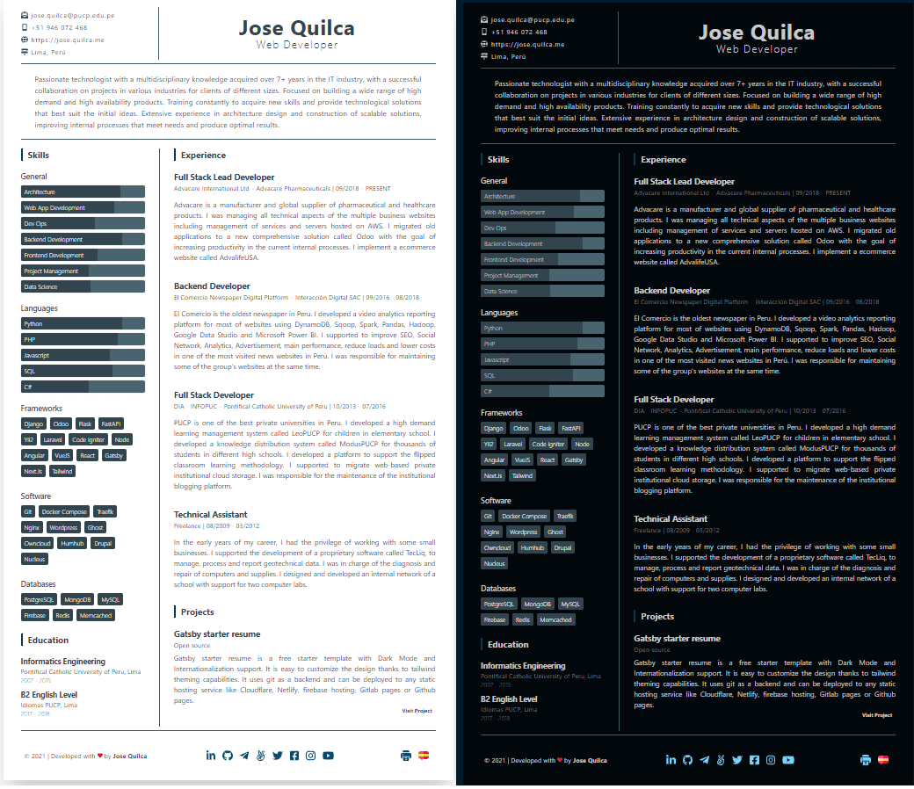

## Description

Gatsby Starter Resume is a free starter template. It is easy to customize the design thanks to tailwind theming capabilities. It uses git as a backend and can be deployed to any static hosting service like Cludflare, Netlify, firebase hosting, Gitlab pages or Github pages.



[Demo](https://jose.quilca.me)

### Features

- One-page resume/CV
- PWA
- Tailwind for styling with theming
- Basic SEO, site metadata
- Dark Mode
- English and Spanish support
- Printable
- Jamstack

## How to install

### Create a Gatsby site

Use the Gatsby CLI to create a new site, specifying the resume starter.

```shell
# create a new Gatsby site using the blog starter
gatsby new my-resume https://github.com/josegustavo/gatsby-starter-resume
```

### Start developing

Navigate into your new site’s directory and start it up.

```shell
cd my-resume/
gatsby develop
```

### Updating Content

The resume content is generated from `src/data/en/resume.json` and `src/data/es/resume.json` files. You can manually edit this file.

You can edit SEO  and site metadata in `gatsby-config.js`

You can customize your theme in `tailwind.config.js`


## How to contribute

If you have unanswered questions, would like help with enhancing or debugging the plugin, it is nice to include instructions for people who want to contribute to your plugin.